ADM SIGNATURE

ACM DIGITAL LIBRARY

Association for Computing Machinery

acm open

2

PDF Download

882262.882295.pdf

22 March 2026

Total Citations: 742

Total Downloads: 4743

Patented

L

Latest updates: https://dl.acm.org/doi/10.1145/882262.882295

Published: 01 July 2003

Citation in BibTeX format

ARTICLE

# T-splines and T-NURCCs

THOMAS W. SEDERBERG, Brigham Young University, Provo, UT, United States

JIANMIN ZHENG, Brigham Young University, Provo, UT, United States

ALMAZ BAKENOV

AHMAD NASRI, American University of Beirut, Beirut, Beirut Governorate, Lebanon

Open Access Support provided by:

Brigham Young University

American University of Beirut

ACM Transactions on Graphics (TOG), Volume 22, Issue 3 (July 2003)

https://doi.org/10.1145/882262.882295

EISSN: 1557-7368

# T-splines and T-NURCCs

Thomas W. Sederberg and Jianmin Zheng
tom@cs.byu.edu zheng@cs.byu.edu
Computer Science Department
Brigham Young University

Almaz Bakenov
bakenov@kyrgyzstan.org
Embassy of Kyrgyz Republic
Washington, D.C.

Ahmad Nasri
anasri@aub.edu.lb
Computer Science Department
American University of Beirut

# Abstract

This paper presents a generalization of non-uniform B-spline surfaces called T-splines. T-spline control grids permit T-junctions, so lines of control points need not traverse the entire control grid. T-splines support many valuable operations within a consistent framework, such as local refinement, and the merging of several B-spline surfaces that have different knot vectors into a single gap-free model. The paper focuses on T-splines of degree three, which are  $C^2$  (in the absence of multiple knots). T-NURCCs (Non-Uniform Rational Catmull-Clark Surfaces with T-junctions) are a superset of both T-splines and Catmull-Clark surfaces. Thus, a modeling program for T-NURCCs can handle any NURBS or Catmull-Clark model as special cases. T-NURCCs enable true local refinement of a Catmull-Clark-type control grid: individual control points can be inserted only where they are needed to provide additional control, or to create a smoother tessellation, and such insertions do not alter the limit surface. T-NURCCs use stationary refinement rules and are  $C^2$  except at extraordinary points and features.

CR Categories: I.3.5 [Computer Graphics]: Computational Geometry and Object Modeling—curve, surface, solid and object representations;

Keywords: B-spline surfaces, subdivision surfaces, local refinement

# 1 Introduction

This paper introduces T-splines: non-uniform B-spline surfaces with T-junctions. T-junctions allow T-splines to be locally refineable: control points can be inserted into the control grid without propagating an entire row or column of control points.

The paper also presents a locally refineable subdivision surface called T-NURCCs (Non-Uniform Rational Catmull-Clark surfaces with T-junctions). In T-NURCCs, faces adjacent to an extraordinary point can be refined without propagating the refinement, and faces in highly curved regions can also be refined locally. As in T-splines, individual control points can also be inserted into a T-NURCC to provide finer control over details. T-NURCCs are a generalization

Permission to make digital/hard copy of part of all of this work for personal or classroom use is granted without fee provided that the copies are not made or distributed for profit or commercial advantage, the copyright notice, the title of the publication, and its date appear, and notice is given that copying is by permission of ACM, Inc. To copy otherwise, to republish, to post on servers, or to redistribute to lists, requires prior specific permission and/or a fee. © 2003 ACM 0730-0301/03/0700-0477 $5.00

of Catmull-Clark surfaces. Figure 1 shows how T-NURCC local refinement enables a T-NURCC tessellation to be far more economical than a globally-refined Catmull-Clark surface. T-splines can be used to merge non-uniform B-spline

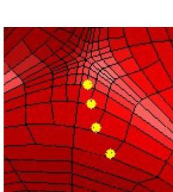
Figure 1: A Catmull-Clark mesh refined using T-NURCC local refinement. T-junctions are highlighted in the blow-up on the left. The T-NURCC has 2496 faces. A globally refined Catmull-Clark surface needs 393,216 faces to achieve the same precision.

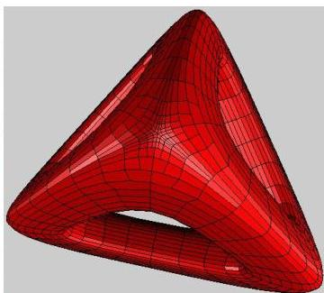

surfaces that have different knot-vectors. Figure 2 shows a hand model comprised of seven B-spline surfaces. The small rectangular area is blown up in Figure 3.a to magnify a hole where neighboring B-spline surfaces do not match exactly. The presence of such gaps places a burden on animators, who potentially must repair a widened gap whenever the model is deformed. Figure 3.b shows the model after being converted into a gap-free T-spline, thereby eliminating the need for repair. T-splines and T-NURCCs can thus imbue models comprised of several non-uniform B-spline surfaces with the same air-tightness that Catmull-Clark surfaces extend to uniform cubic B-spline-based models.

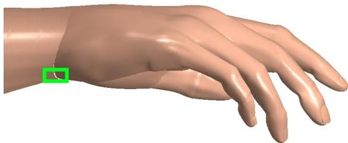
Figure 2: Model of a hand comprised of B-spline surfaces.

# 1.1 Related Work

Previous papers have addressed local triangular tessellation refinement of subdivision surfaces [Velho and Zorin 2001; Kobbelt 2000]. In order to have the neighborhood of a new vertex at some uniform level, the 4-8 and  $\sqrt{3}$  schemes impose the restriction of at most one refinement level differ

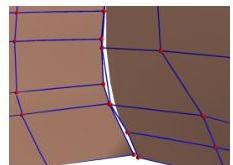
a. B-spline surfaces

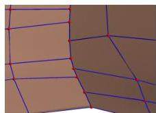
b. T-splines
Figure 3: A gap between two B-spline surfaces, fixed with a T-spline.

ence between adjacent triangles. For quadrilateral subdivision meshes, it is considered difficult to generate a locally refinable crack-free tessellation [Zorin and Schröder 2000]. With T-NURCCs, local refinement away from extraordinary points has no notion of "level." Hence, it is possible for local refinement to produce an edge that has one face on one side, and any number of faces on the other side.

T-NURCCs are a modification of cubic NURSSes [Sederberg et al. 1998]), augmented by the local refinement capability of T-splines. T-NURCCs and cubic NURSSes are the only subdivision surfaces that generalize non-uniform cubic B-spline surfaces to control grids of arbitrary topology and (equivalently) that generalize Catmull-Clark surfaces [Catmull and Clark 1978] to non-uniform knot vectors. However, cubic NURSSes have complicated, non-stationary refinement rules whereas NURCCs have stationary refinement rules. Furthermore, cubic NURSSes do not provide local refinement whereas T-NURCCs do.

The literature on local control refinement of B-spline surfaces (a single control point can be inserted without propagating an entire row or column of control points) was initiated by Forsey and Bartels. Their invention of Hierarchical B-splines [Forsey and Bartels 1988] introduced two concepts: local refinement using an efficient representation, and multi-resolution editing. These notions extend to any refineable surface such as subdivision surfaces. T-splines and T-NURCCs involve no notion of hierarchy: all local refinement is done on one control grid on a single hierarchical "level" and all control points have similar influence on the shape of the surface.

Hierarchical B-splines were also studied by Kraft [Kraft 1998]. He constructed a multilevel spline space which is a linear span of tensor product B-splines on different, hierarchically ordered grid levels. His basic idea is to provide a selection mechanism for B-splines which guarantees linear independence to form a basis. CHARMS [Grinspun et al. 2002] focuses on the space of basis functions in a similar way, but in a more general setting and hence with more applications. Weller and Hagen [Weller and Hagen 1995] studied spaces of piecewise polynomials with an irregular, locally refinable knot structure. They considered the domain partition with knot segments and knot rays in the tensor-product B-spline domain. Their approach is restricted to so-called "semi-regular bases."

Our derivations make use of polar form [Ramshaw 1989], and we assume the reader to be conversant with polar labels for tensor-product B-spline surfaces.

# 1.2 Overview

T-splines and T-NURCCs use knot intervals to convey knot information. This is reviewed in  $\S 2$ .

T-splines are an enhancement of NURBS surfaces that allow the presence of T-junction control points. We describe

T-splines by introducing in §3 a less structured form of the idea, that we call point-based B-splines, or PB-splines. T-splines are then discussed in §4, and local refinement is explained in §5. The application of using T-splines for merging two or more B-splines into a gap-free model is presented in §6.

NURCCs are obtained by placing a restriction on the definition of cubic NURSSes (introduced in [Sederberg et al. 1998]) which gives NURCCs stationary refinement rules. T-NURCCs add to NURCCs the local refinement capability of T-splines. This is discussed in §7.

While the notion of T-splines extends to any degree, we restrict our discussion to cubic T-splines. Cubic T-splines are  $C^2$  in the absence of multiple knots.

# 2 Knot Intervals

A knot interval is a non-negative number assigned to each edge of a T-spline control grid for the purpose of conveying knot information. This notion was introduced in [Sederberg et al. 1998]. In the cubic B-spline curve shown in Figure 4,

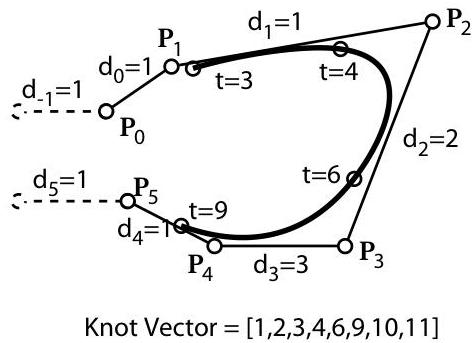
Figure 4: Sample cubic B-spline curve

the  $d_{i}$  values that label each edge of the control polygon are knot intervals. Note how each knot interval is the difference between two consecutive knots in the knot vector. For a non-periodic curve, end-condition knot intervals are assigned to "phantom" edges adjacent to each end of the control polygon (in this case  $d_{-1}$  and  $d_{5}$ ). For all but the first and last edges of the control polygon, the knot interval of each edge is the parameter length of the curve segment to which the edge maps. Any constant could be added to the knots in a knot vector without changing the knot intervals for the curve. Thus, if we are given the knot intervals and we wish to infer a knot vector, we are free to choose a knot origin.

Edges of T-spline and T-NURCC control grids are likewise labeled with knot intervals. Since T-NURCC control meshes are not rectangular grids, knot intervals allow us to impose local knot coordinate systems on the surface. Figure 5.a shows a regular subgrid of a NURCC control grid. We can impose a local knot coordinate system on this region, and therewith determine local polar labels for the control points, as follows. First, (arbitrarily) assign  $\mathbf{P}_{00}$  the local knot coordinates of  $(d_0,e_0)$ . The local knot vectors for this regular subgrid are then  $\{d\} = \{0,\bar{d}_0,\bar{d}_1,\ldots \}$  and  $\{e\} = \{0,\bar{e}_0,\bar{e}_1,\ldots \}$  where

$$
\bar {d _ {i}} = \sum_ {j = 0} ^ {i} d _ {j}; \qquad \bar {e} _ {i} = \sum_ {j = 0} ^ {i} e _ {j}
$$

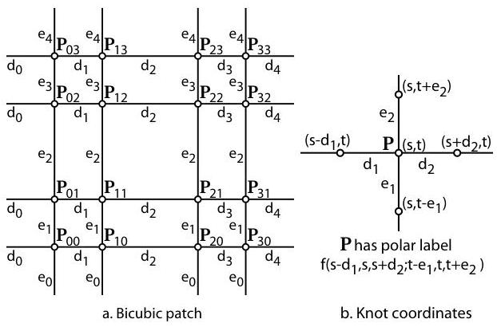
Figure 5: Region of a NURBS control mesh labeled with knot intervals.

and $\bar{d}_{-1} = \bar{e}_{-1} = 0$. The polar label for control point $\mathbf{P}_{ij}$, with respect to this local knot coordinate system, is thus $f(\bar{d}_{i - 1},\bar{d}_i,\bar{d}_{i + 1};\bar{e}_{i - 1},\bar{e}_i,\bar{e}_{i + 1})$ and the surface defined by this regular subgrid is

$$
\mathbf {P} (s, t) = \sum_ {i} \sum_ {j} \mathbf {P} _ {i j} N _ {i} ^ {3} (s) N _ {j} ^ {3} (t)
$$

where $N_{i}^{3}(s)$ are the cubic B-spline basis functions over $\{d\}$ and the $N_{j}^{3}(t)$ are over $\{e\}$. The superscript 3 denotes degree, not order.

# 3 PB-splines

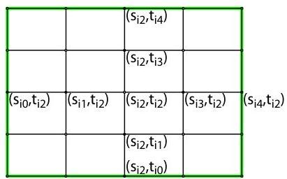
Figure 6: Knot lines for basis function $B_{i}(s,t)$.

Tensor-product B-spline surfaces use a rectangular grid of control points. Our goal is to generalize B-spline surface to allow partial rows or columns of control points. We begin by describing a surface whose control points have no topological relationship with each other whatsoever. We will refer to this surface as a $PB$-spline, because it is point based instead of grid based. The equation for a PB-spline is

$$
\mathbf {P} (s, t) = \frac {\sum_ {i = 1} ^ {n} \mathbf {P} _ {i} B _ {i} (s , t)}{\sum_ {i = 1} ^ {n} B _ {i} (s , t)}, \quad (s, t) \in \mathbf {D} \tag {1}
$$

where the $\mathbf{P}_i$ are control points. The $B_{i}(s,t)$ are basis functions given by

$$
B _ {i} (s, t) = N _ {i 0} ^ {3} (s) N _ {i 0} ^ {3} (t) \tag {2}
$$

where $N_{i0}^{3}(s)$ is the cubic B-spline basis function associated with the knot vector

$$
\mathbf {s} _ {i} = \left[ s _ {i 0}, s _ {i 1}, s _ {i 2}, s _ {i 3}, s _ {i 4} \right] \tag {3}
$$

and $N_{i0}^{3}(t)$ is associated with the knot vector

$$
\mathbf {t} _ {i} = \left[ t _ {i 0}, t _ {i 1}, t _ {i 2}, t _ {i 3}, t _ {i 4} \right] \tag {4}
$$

as illustrated in Figure 6. Thus, to specify a PB-spline, one must provide a set of control points and a pair of knot vectors for each control point.

The green box outlines the influence domain $\mathbf{D}_i = (s_{i0}, s_{i4}) \times (t_{i0}, t_{i4})$ for an individual control point $\mathbf{P}_i$. $B_i(s, t)$ and its first and second derivatives all vanish at (and outside of) the green box. It is permissible for influence domains to not be axis-aligned, although our discussion will assume that they are axis-aligned.

PB-splines satisfy the convex-hull property. Denote $C(s,t) = \{\mathbf{P}_i|(s,t)\in \mathbf{D}_i\}$. Then clearly $\mathbf{P}(s,t)$ lies in the convex hull of $C(s,t)$.

$\mathbf{D}$ in (1) is the domain over which the entire PB-spline is defined. The only restrictions on $\mathbf{D}$ is that $\sum_{i=1}^{n} B_i(s, t) &gt; 0$ for all $(s, t) \in \mathbf{D}$ and $\mathbf{D}$ is a single connected component. This implies that $\mathbf{D} \subset \{\mathbf{D}_1 \cup \mathbf{D}_2 \cup \ldots \cup \mathbf{D}_n\}$, but $\mathbf{D}$ does not need to be rectangular. Due to the convex hull property, if $(s, t) \in \mathbf{D}$ lies only in one influence domain $\mathbf{D}_i$, then $\mathbf{P}(s, t) = \mathbf{P}_i$; if $(s, t) \in \mathbf{D}$ lies only in two influence domains $\mathbf{D}_i$ and $\mathbf{D}_j$, then $\mathbf{P}(s, t)$ lies on the line segment connecting $\mathbf{P}_i$ and $\mathbf{P}_j$, etc. Thus, it is advisable to have each point in $\mathbf{D}$ lie in at least three influence domains $\mathbf{D}_i$. In general, there is not an obvious "best" choice for $\mathbf{D}$ for a given set of $\mathbf{D}_i$.

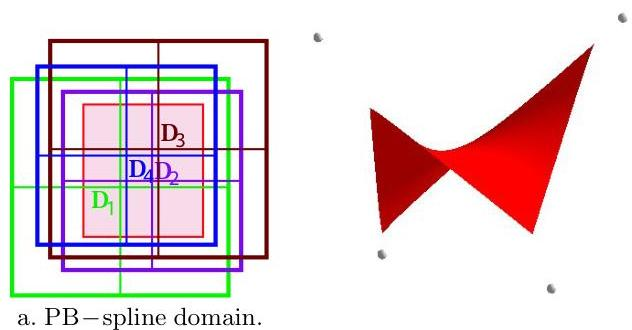
Figure 7: A cubic PB-spline with four control points.

Figure 7.a shows a parameter space in which is drawn the $\mathbf{D}_i$ for a PB-spline comprised of four blending functions. The resulting surface is shown to the right. The labels $\mathbf{D}_i$ are printed at the center of the respective domains, and a possible choice for $\mathbf{D}$ is outlined in red. Notice that a PB-spline has no notion of a control mesh; the knot vectors for each basis function are completely independent of the knot vectors for any other basis function.

# 4 T-Splines

A T-spline is a PB-spline for which some order has been imposed on the control points by means of a control grid called a $T$-mesh. A T-mesh serves two purposes. First, it provides a more friendly user interface than does the completely arbitrary PB-spline control points. Second, the knot vectors $\mathbf{s}_i$ and $\mathbf{t}_i$ for each basis function are deduced from the T-mesh. If a T-mesh is simply a rectangular grid with no T-junctions, the T-spline reduces to a B-spline.

Figure 8 shows the pre-image of a T-mesh in $(s,t)$ parameter space. The $s_i$ denote $s$ coordinates, the $t_i$ denote $t$

coordinates, and the  $d_{i}$  and  $e_i$  denote knot intervals, with red edges containing boundary-condition knot intervals. Thus, for example,  $s_4 = s_3 + d_3$  and  $t_5 = t_4 + e_4$ . Each vertex has knot coordinates. For example,  $\mathbf{P}_1$  has knot coordinates  $(s_3,t_2)$  and  $\mathbf{P}_2$  has knot coordinates  $(s_5 - d_8,t_3)$ .

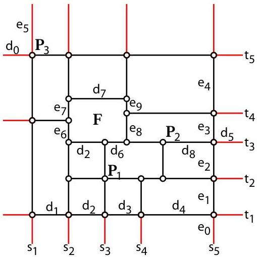
Figure 8: Pre-image of a T-mesh.

A T-mesh is basically a rectangular grid that allows T-junctions. The pre-image of each edge in a T-mesh is a line segment of constant  $s$  (which we will call an  $s$ -edge) or of constant  $t$  (which we will call a  $t$ -edge). A T-junction is a vertex shared by one  $s$ -edge and two  $t$ -edges, or by one  $t$ -edge and two  $s$ -edges. Each edge in a T-mesh is labeled with a knot interval, constrained by the following rules:

Rule 1. The sum of knot intervals on opposing edges of any face must be equal. Thus, for face  $\mathbf{F}$  in Figure 8,  $d_{2} + d_{6} = d_{7}$  and  $e_6 + e_7 = e_8 + e_9$ .

Rule 2. If a T-junction on one edge of a face can be connected to a T-junction on an opposing edge of the face (thereby splitting the face into two faces) without violating Rule 1, that edge must be included in the T-mesh.

To each  $\mathbf{P}_i$  corresponds a basis function  $B_{i}(s,t)$  (2) defined in terms of knot vectors  $\mathbf{s}_i = [s_{i0},s_{i1},s_{i2},s_{i3},s_{i4}]$  (3) and  $\mathbf{t}_i = [t_{i0},t_{i1},t_{i2},t_{i3},t_{i4}]$  (4). We now explain how to infer these knot vectors from the T-grid. The knot coordinates of  $\mathbf{P}_i$  are  $(s_{i2},t_{i2})$ . The knots  $s_{i3}$  and  $s_{i4}$  are found by considering a ray in parameter space  $\mathbf{R}(\alpha) = (s_{i2} + \alpha ,t_{i2})$ . Then  $s_{i3}$  and  $s_{i4}$  are the  $s$  coordinates of the first two  $s$ -edges intersected by the ray (not including the initial  $(s_{i2},t_{i2})$ ). The other knots in  $\mathbf{s}$  and  $\mathbf{t}$  are found in like manner.

Thus, for  $\mathbf{P}_1$ ,  $\mathbf{s}_i = [s_1,s_2,s_3,s_4,s_5 - d_8]$  and  $\mathbf{t}_i = [t_1 - e_0,t_1,t_2,t_3,t_4 + e_9]$ . Likewise, for  $\mathbf{P}_2$ ,  $\mathbf{s}_i = [s_3,s_3 + d_6,s_5 - d_8,s_5,s_5 + d_5]$  and  $\mathbf{t}_i = [t_1,t_2,t_3,t_4,t_5]$ .  $\mathbf{P}_3$  is a boundary control point. In this case,  $s_{3,0}$  and  $t_{3,4}$  do not matter, so we can take  $\mathbf{s}_i = [s_1 - d_0,s_1 - d_0,s_1,s_2,s_2 + d_7]$  and  $\mathbf{t}_i = [t_1,t_5 - e_4 + e_9 - e_7,t_5,t_5 + e_5,t_5 + e_5]$ . Once these knot vectors are determined for each basis function, the T-spline is defined using the PB-spline equation (1).

The motivation for Rule 2 is illustrated in Figure 9. In this case, the zero knot interval means that it is legal to have an edge connecting  $\mathbf{P}$  with  $\mathbf{A}$ , and is also legal to have an edge connecting  $\mathbf{P}$  and  $\mathbf{B}$ . However, these two choices will result in different  $\mathbf{t}$  knot vectors for  $\mathbf{P}$ . Rule 2 resolves such ambiguity.

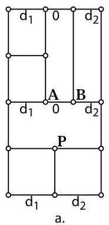
Figure 9: Possible ambiguity.

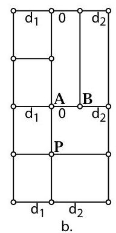

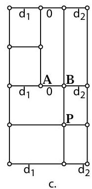

Plainly, if the T-mesh is a regular grid, the T-spline reduces to a tensor product B-spline surface.

# 5 Control Point Insertion

We now consider the problem of inserting a new control point into an existing T-mesh. If the sole objective of control point insertion is to provide additional control, it is possible to simply add additional control points to a T-mesh, and leave the Cartesian coordinates of the initial control points unchanged. Of course, this operation will alter the shape of the T-spline (at least, that portion of it within the influence of the new control points).

It is usually more desirable to insert control points into a T-mesh in such a way that the shape of the T-spline is not changed. We now describe how to add a single control point in this way. We will refer to this procedure of adding a single control point into a T-mesh without changing the shape of the T-spline as local knot insertion.

Consider the example in Figure 10 where control point  $\mathbf{P}_3^{\prime}$  is inserted on edge  $\mathbf{P}_2\mathbf{P}_4$  using the knot intervals shown. We enforce the following

Rule 3.  $\mathbf{P}_3^{\prime}$  can only be inserted if  $\mathbf{t}_1 = \mathbf{t}_2 = \mathbf{t}_4 = \mathbf{t}_5$  (see Figure 10). Recall that  $\mathbf{t}_i$  is the  $t$ -knot vector for basis function  $B_i$ . If the control point were being inserted on a vertical edge, the four neighboring  $\mathbf{s}_i$  knot vectors would need to be equal.

Local knot insertion is accomplished by performing knot insertion into all of the basis functions whose knot vectors will be altered by the presence of the new control point. In Figure 10, the only such basis functions are  $B_{1}$ ,  $B_{2}$ ,  $B_{4}$ , and  $B_{5}$  (the basis functions corresponding to control points  $\mathbf{P}_{1}$ ,  $\mathbf{P}_{2}$ ,  $\mathbf{P}_{4}$ , and  $\mathbf{P}_{5}$ ). Using the algebra of polar forms,

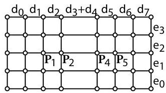
a. Before insertion.
Figure 10: T-mesh knot insertion.

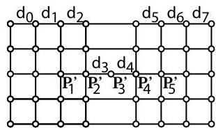
b. After insertion.

and because of Rule 3, it is straightforward to show that

$\mathbf{P}_1^{\prime} = \mathbf{P}_1$, $\mathbf{P}_5^{\prime} = \mathbf{P}_5$,

$$
\mathbf {P} _ {2} ^ {\prime} = \frac {d _ {4} \mathbf {P} _ {1} + \left(d _ {1} + d _ {2} + d _ {3}\right) \mathbf {P} _ {2}}{d _ {1} + d _ {2} + d _ {3} + d _ {4}}, \tag {5}
$$

$$
\mathbf {P} _ {4} ^ {\prime} = \frac {\left(d _ {4} + d _ {4} + d _ {4}\right) \mathbf {P} _ {4} + d _ {3} \mathbf {P} _ {5}}{d _ {3} + d _ {4} + d _ {5} + d _ {6}}, \text { and} \tag {6}
$$

$$
\mathbf {P} _ {3} ^ {\prime} = \frac {\left(d _ {4} + d _ {5}\right) \mathbf {P} _ {2} + \left(d _ {2} + d _ {3}\right) \mathbf {P} _ {3}}{d _ {2} + d _ {3} + d _ {4} + d _ {5}}. \tag {7}
$$

Rule 3 means that it is not always possible to immediately add a control point to any edge. For example, in Figure 11.a, Rule 3 does not allow $\mathbf{A}$ to be inserted because $\mathbf{t}_2$ is different from $\mathbf{t}_1$, $\mathbf{t}_4$, and $\mathbf{t}_5$. However, if control points are first added beneath $\mathbf{P}_1$, $\mathbf{P}_4$, and $\mathbf{P}_5$ as shown in Figure 11.b, it then becomes legal to insert $\mathbf{A}$.

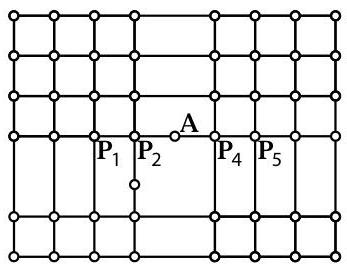
a. A cannot be inserted.

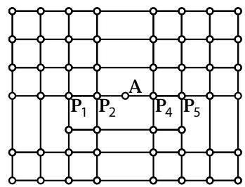
b. A can be inserted.

Local knot insertion can only be performed on an existing edge. To insert a control point in the middle of a face, an edge through that face must first be created.

Local knot insertion is useful for creating features. For example, darts can be introduced into a T-spline by inserting a few adjacent rows of control points with zero knot intervals, as shown in Figure 12. Having two adjacent knot intervals of value zero introduces a local triple knot, and the surface becomes locally $C^0$ at that knot. The sharpness of the crease is controlled by the placement of the inserted control points.

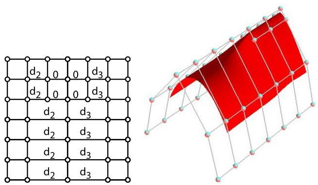
Figure 12: Inserting a dart into a T-mesh.

# 5.1 Standard T-splines

We define a standard $T$-spline to be one whose basis functions $B_{i}(s,t)$ in equation (1) sum to one for every $(s,t)\in \mathbf{D}$. Clearly, a tensor product B-spline surface is a standard T-spline. Likewise, a standard T-spline that undergoes knot

insertion remains a standard T-spline. Furthermore, a T-spline formed by merging two B-spline surfaces (as discussed in §6) is a standard T-spline.

A standard T-spline can be decomposed into polynomial bi-cubic patches. A non-standard T-spline can also be decomposed into bi-cubic patches, but they will be rational patches.

# 5.2 Extracting Bézier Patches

It is advantageous to represent in Bézier form the patches that comprise a T-spline, because a tessellation algorithm such as [Rockwood et al. 1989] can then be applied—with the minor modification that each T-junction must map to a triangle vertex in the tessellation to assure that cracks will not appear in the tessellation.

The domains of the Bézier patches that comprise a standard T-spline can be determined by extending all T-junctions by two bays, as illustrated in Figure 13. The rectangles in Figure 13.b are Bézier domains. The reason for this can be understood by considering the knot vectors for the basis functions of each control point.

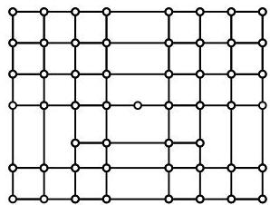
a. T-mesh.

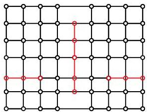
b. Bezier domains.
Figure 13: Bézier domains in the pre-image of a T-mesh.

Bézier control points can be obtained by performing repeated local knot insertion. Recall that a B-spline surface can be expressed in Bézier form using multiple knots, and that a zero-knot interval implies a double knot. For the knot interval configuration in Figure 14.b, the $4 \times 4$ grid of control points surrounding $\mathbf{F}$ are the Bézier control points of that patch. Thus, the Bézier control points for face $\mathbf{F}$

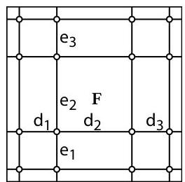
a. Face $\mathbf{F}$.

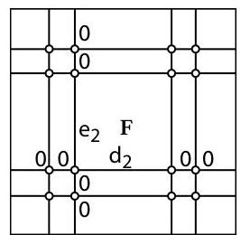
b. Bézier control points.
Figure 14: Finding Bézier control points using local knot insertion.

in Figure 14.a can be determined by performing local knot insertion.

# 6 Merging B-splines into a T-spline

This section discusses how to merge two B-spline surfaces with different knot vectors into a single T-spline. Often in

geometric modeling, portions of an object are modeled independently with different B-spline surfaces that have different knot vectors, such as the hand in Figure 2. Figure 15 illustrates the problem: the red and blue control grids are defined over different knot vectors. Merging them into a single B-spline requires that they have the same common knot vector, so knot insertion must first be performed before merging can proceed. As Figure 15.c illustrates, however, those required knot insertions can significantly increase the number of rows of control points. If additional surfaces are subsequently merged onto these two surfaces, the number of knot lines can multiply further.

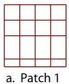
Figure 15: Merging two B-splines.

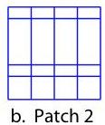

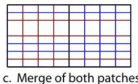

One possible solution to the problem of merging two NURBS surfaces into a single surface without a proliferation of control points is to use cubic NURSSes [Sederberg et al. 1998]. Since cubic NURSSes allow different knot intervals on opposing edges of a face, two NURBS control grids can be merged into a single control grid without propagating knot lines. This approach was studied in [Bakenov 2001]. Figure 16 shows the result of merging two identical B-spline cylinders with different knot vectors. Unfortunately, any NURSS representation introduces an unsightly bump at the junction of the two cylinders. This failed attempt at solving the merge problem using NURSSes motivated the creation of T-splines.

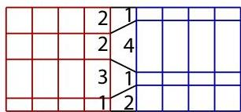
Figure 16: Merging two B-splines using cubic NURSSes.

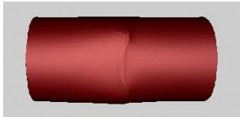

The procedure using T-splines is illustrated in Figure 17. For a  $C^n$  merge ( $n \in \{-1,0,1,2\}$ ),  $n + 1$  columns of control points on one patch will correspond to  $n + 1$  columns of control points on the other patch. We consider first the  $C^0$  merge in Figure 17.a. To begin with, each B-spline must have triple knots (double knot intervals) along the shared boundary, as shown. For a  $C^0$  merge, one column of control points will be shared after the merge. If the knot intervals for the two T-splines differ along that common column, control points must be along the boundary edge so that the knot intervals agree. In this example, the knot intervals on the red B-spline are 1,3,2,2 and on the blue B-spline are 2,1,4,1. After inserting offset control points on each control grid along the soon-to-be-joined columns as shown, the common column of control points has knot intervals 1,1,1,1,2,1,1.

Typically in this process, the control points that are to be merged will have slightly different Cartesian coordinates. For example,  $A$  on the red patch might differ slightly from  $A$  on the blue patch. Simply take the average of those two positions to determine the position of the merged control point.

A  $C^2$  merge is illustrated in Figure 17.b. The basic idea is the same as for a  $C^0$  merge. The differences are that four knot intervals  $a, b, c, d$  must correspond between the two surfaces, as shown. Also, three columns of control points must be merged, as shown. Figure 18 shows the results of a  $C^0$  and a  $C^1$  merge. Figure 3 shows an application of this merge capability in a NURBS model of a human hand. This is a  $C^0$  merge.

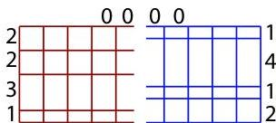
Initial control grids

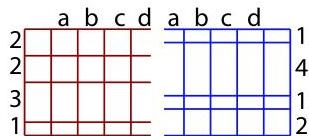
Initial control grids

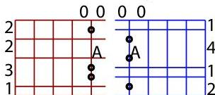
Insert control points

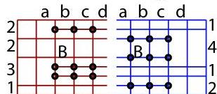
Insert control points

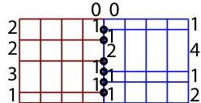
a.  $C^0$  merge
Merges as T-spline
b.  $C^2$  merge

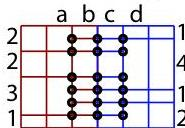

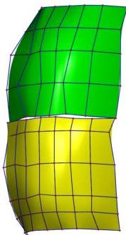
a. Two B-splines grid
Figure 18: Merging of two B-splines.

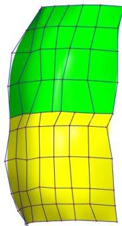
Figure 17: Merging two B-splines using T-splines.

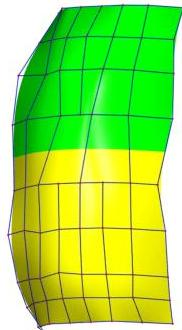
c.  $C^1$  T-spline

# 7 T-NURCCs

We now present a modification of cubic NURSSes [Sederberg et al. 1998] that we call NURCCs (Non-Uniform Rational Catmull-Clark Surfaces). T-NURCCs are NURCCs with T-junctions in their control grids, in the spirit of T-splines.

Both NURRCs and NURSSes are generalizations of tensor product non-uniform B-spline surfaces: if there are no extraordinary points, if all faces are four-sided, and if the knot intervals on opposing edges of each face are equal, NURCCs and cubic NURSSes both degenerate to non-uniform B-spline surfaces. NURRCs and NURSSes are also generalizations of Catmull-Clark surfaces: if all knot intervals are equal, NURCCs and cubic NURSSes both degenerates to a Catmull-Clark surface.

NURCCs are identical to cubic NURSSes, with one difference: NURCCs enforce the constraint that opposing edges of each four-sided face have the same knot interval while NURSSes have no such restriction. It is for that reason that NURSSes have non-stationary subdivision rules and NURCCs have stationary refinement rules. It is also for that reason that NURCCs are capable of local refinement, whereas NURSSes are not.

The refinement rules for NURCCs are thus identical to the refinement rules for NURSSes if we require opposing edges of each four-sided face to have the same knot interval. Those refinement rules are discussed in [Sederberg et al. 1998].

We now discuss how T-junctions can be used to perform local refinement in the neighborhood of an extraordinary point. To simplify our discussion, we first require that all extraordinary points are separated by at least four faces, and that all faces are four-sided. These requirements can be met by performing a few global refinement steps, if needed. Thereafter, all refinement can be performed locally. For example, any suitably large regular subgrid of a NURCC control grid can undergo local knot insertion, as discussed in §5. Also, refinement near an extraordinary point can be confined to the neighborhood of the extraordinary point.

To explain how to do this, we first devise a way to perform local knot insertion in the neighborhood of a single (valence-four) vertex in a T-spline. Referring to Figure 19, we begin

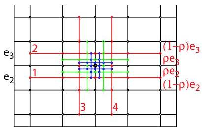
Figure 19: Local refinement about a valence-four control point.

with the black control grid. Then, it is legal using the procedure in §5 to insert all of the red control points in row 1, followed by row 2, followed by column 3, followed by column 4. Then the green control points can legally be inserted in like order, then the blue control points, etc. What is produced is a local refinement in the immediate neighborhood of one black control point. Note that this refinement scheme can split faces at any ratio  $\rho$ . For a valence-4 point, changing  $\rho$  does not change the limit surface since we are merely doing B-spline knot insertion, but when we adapt this scheme to extraordinary points,  $\rho$  will serve as a shape parameter. Figure 21 shows the effects of changing  $\rho$ .

We now present the local refinement rules for T-NURCCs at an isolated extraordinary point. Referring to Figure 20, knot interval  $d_{1}$  is split into knot intervals  $\rho d_{1}$  and  $(1 - \rho)d_{1}$ ; likewise for the other knot intervals adjacent to the extraordinary point. If  $\rho = \frac{1}{2}$  and if all the initial knot intervals are equal, the limit surface obtained using this local refinement is equivalent to a Catmull-Clark surface.

Lower-case letters refer to knot intervals and upper-case letters to points. Vertices  $A, B, C, D, Q, R, S, T$  are the initial control points, prior to refinement. After refinement, these vertex points are replaced by new vertex points denoted with primes:  $A', B', C', D', Q', R'$ . The following equations for  $A', E_1$ , and  $F_1$  are obtained from [Sederberg et al. 1998]. All other equations are obtained by repeated

application of (5)-(7).

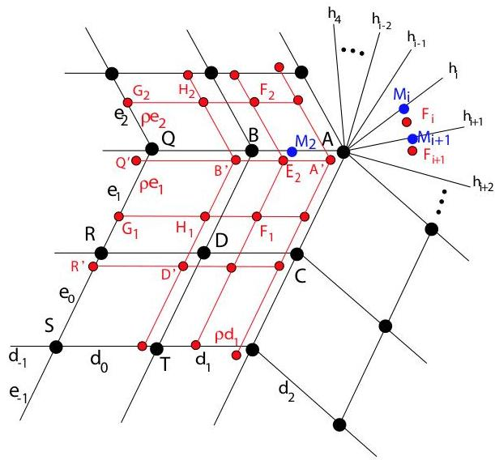
Figure 20: Local refinement about an  $n$ -valence control point.

$$
\begin{array}{l} F _ {1} = \frac {[ e _ {0} + (1 - \rho) e _ {1} ] [ (d _ {0} + (1 - \rho) d _ {1}) A + (\rho d _ {1} + d _ {2}) B ]}{(d _ {0} + d _ {1} + d _ {2}) (e _ {0} + e _ {1} + e _ {2})} \\ + \frac {[ \rho e _ {1} + e _ {2} ] [ (d _ {0} + (1 - \rho) d _ {1}) C + (\rho d _ {1} + d _ {2}) D ]}{(d _ {0} + d _ {1} + d _ {2}) (e _ {0} + e _ {1} + e _ {2})} \\ \end{array}
$$

There are three types of edge points:  $E$ ,  $H$ , and  $G$ .

$$
E _ {2} = \rho M _ {2} + (1 - \rho) \frac {e _ {2} F _ {1} + e _ {1} F _ {2}}{e _ {1} + e _ {2}}
$$

where

$$
M _ {2} = \frac {2 \rho d _ {1} + d 2 + h _ {4}}{2 (d _ {0} + d _ {1}) + d _ {2} + h _ {4}} B + \frac {2 d _ {0} + 2 (1 - \rho) d _ {1}}{2 (d _ {0} + d _ {1}) + d _ {2} + h _ {4}} A.
$$

Edge point  $H_{1} = \frac{\rho d_{1}[(\rho e_{1} + e_{2})R + (e_{0} + (1 - \rho)e_{1})Q]}{(d_{-1} + d_{0} + d_{1})(e_{0} + e_{1} + e_{2})}$

$$
+ \frac {[ d _ {- 1} + d _ {0} + (1 - \rho) d _ {1} ] [ (\rho e _ {1} + e _ {2}) D + (e _ {0} + (1 - \rho) e _ {1}) B ]}{(d _ {- 1} + d _ {0} + d _ {1}) (e _ {0} + e _ {1} + e _ {2})}
$$

Edge point  $G_{1} = \frac{\rho e_{1} + e_{2}}{e_{0} + e_{1} + e_{2}} R + \frac{e_{0} + (1 - \rho)e_{1}}{e_{0} + e_{1} + e_{2}} Q$ .

There are five different types of vertex points: those that replace  $A$ ,  $B$ ,  $Q$ ,  $D$ , and  $R$ . We will denote the new vertex point at  $A$  by  $A'$ , etc.

$$
A ^ {\prime} = \rho^ {2} A + 2 \rho (1 - \rho) \frac {\sum_ {i = 0} ^ {n - 1} m _ {i} M _ {i}}{\sum_ {i = 0} ^ {n - 1} m _ {i}} + (1 - \rho) ^ {2} \frac {\sum_ {i = 0} ^ {n - 1} f _ {i} F _ {i}}{\sum_ {i = 0} ^ {n - 1} f _ {i}}
$$

where  $n$  is the valence,  $m_{i} = (h_{i - 1} + h_{i + 1})(h_{i - 2} + h_{i + 2}) / 2,$  and  $f_{i} = h_{i - 1}h_{i + 2}$

$$
\begin{array}{l} B ^ {\prime} = (1 - \rho) \frac {e _ {1} H _ {2} + e _ {2} H _ {1}}{e _ {1} + e _ {2}} \\ + \rho \left[ \frac {\rho d _ {1}}{d _ {- 1} + d _ {0} + d _ {1}} Q + \frac {d _ {- 1} + d _ {0} + (1 - \rho) d _ {1}}{d _ {- 1} + d _ {0} + d _ {1}} B \right] \\ \end{array}
$$

$Q^{\prime} = \rho Q + (1 - \rho)\frac{e_{1}G_{2} + e_{2}G_{1}}{e_{1} + e_{2}}$
$D^{\prime} = \frac{\rho d_{1}\rho e_{1}S + [d_{-1} + d_{0} + (1 - \rho)d_{1}]\rho e_{1}T}{(d_{-1} + d_{0} + d_{1})(e_{-1} + e_{0} + e_{1})}$
+  $\frac{[\rho d_1R + (d_{-1} + d_0 + (1 - \rho)d_1)D][e_{-1} + e_0 + (1 - \rho)e_1]}{(d_{-1} + d_0 + d_1)(e_{-1} + e_0 + e_1)}$
$R^{\prime} = \frac{\rho e_{1}}{e_{-1} + e_{0} + e_{1}} S + \frac{e_{-1} + e_{0} + (1 - \rho)e_{1}}{e_{-1} + e_{0} + e_{1}} R.$

Local refinement at an extraordinary point is illustrated in Figure 1, which shows a T-NURCC that has undergone four steps of local refinement. The yellow dots highlight four T-junctions. Note that this locally-refined mesh has two orders of magnitude fewer faces than it would have using global Catmull-Clark refinement.

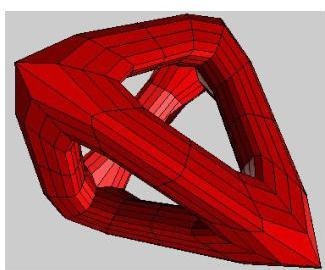

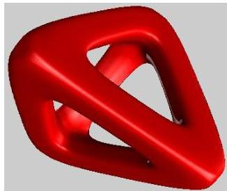

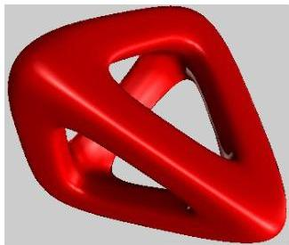
Figure 21: A T-NURCC showing the influence of the parameter  $\rho$ . The initial control grid is on the top left, the limit surface with  $\rho = 0.1$  is on the top right,  $\rho = 0.5$  is on the bottom left, and  $\rho = 0.9$  is on the bottom right.

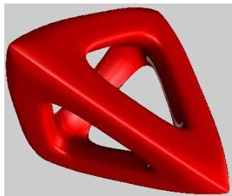

This discussion has assumed that extraordinary vertices are separated by at least four faces; this can always be accomplished by performing a few preliminary global refinement steps. It is possible to derive local refinement rules that would not require such initial global refinement steps, but there are additional special cases to consider.

Away from extraordinary points, NURCCs are  $C^2$ , except that zero knot intervals will lower the continuity. At extraordinary points where all edges have the same knot interval value, an eigenanalysis for the valence 3 case shows  $\lambda_1 = 1 &gt; \lambda_2 = \lambda_3 &gt; \lambda_4 &gt; \dots$  where, for example,

$\lambda_{2} = \lambda_{3} = \frac{1 + 2\rho + \rho^{2} + \sqrt{(\rho^{2} + 6\rho + 1)(\rho - 1)^{2}}}{4}\rho .$

This gives analytic proof that for the valence three case, the surface is  $G^{1}$  for any legal value of  $\rho$  ( $0 &lt; \rho &lt; 1$ ). A similar result can be obtained for valence five. For higher valence, the symbolic algebra expressions get unwieldy, but a sampling of specific values of  $\rho$  has not revealed any case where the  $G^{1}$  condition is not satisfied. If the knot intervals for edges neighboring on extraordinary point are not equal, the situation is related to that analyzed and discussed in [Sederberg et al. 1998], which observes that empirical evidence suggests  $G^{1}$ .

# 8 Conclusion

This paper presents the theoretical foundation for T-splines and T-NURCCs. The formulation is simple and straightforward to implement. T-splines and T-NURCCs permit true local refinement: control points can be added without altering the shape of the surface, and (unless there are knot intervals with a value of zero) the new control points can be moved and the surface will remain  $C^2$ .

Since T-NURCCs generalize NURBS and Catmull-Clark surfaces, a modeling program based on T-NURCCs can handle any NURBS or Catmull-Clark model as a special case.

Several questions remain to be investigated. For example, we have presented sufficient conditions for a T-spline to be standard. What are the necessary conditions? Also, a local knot insertion sometimes requires that other local knot insertions must first be performed. Those local knot insertions might require others to be performed before they can be, etc. Are there cases in which these prerequisites cannot all be satisfied? PB-splines are interesting in their own right. What are the fairness properties of PB-splines?

# 9 Acknowledgements

This work was funded in part by NSF grant CCR-9912411. Jianmin Zheng was also supported by NSF of China (69973042).

# References

BAKENOV, A. 2001. T-Splines: Tensor Product B-spline Surfaces with  $T$ -Junctions. Master's thesis, Brigham Young University.
CATMULL, E., AND CLARK, J. 1978. Recursively Generated B-spline Surfaces On Arbitrary Topological Meshes. Computer-Aided Design 10, 350-355.
FORSEY, D., AND BARTELS, R. H. 1988. Hierarchical B-spline refinement. Computer Graphics 22, 4(August 1988), 205-212.
GRINSPUN, E., KRYSL, P., AND SCHRODER, P. 2002. Charms: A simple framework for adaptive simulation. ACM Transactions on Graphics 21, 3 (July), 281-290.
KOBBELT, L. 2000.  $\sqrt{3}$ -subdivision. Computer Graphics, 103-112. SIGGRAPH 2000.
KRAFT, R. 1998. Adaptive and linearly independent multilevel B-splines. In Surface Fitting and Multiresolution Methods, A. L. Mehaute, C. Rabut, and L. L. Schumaker, Eds. Vanderbilt University Press, Nashville, 209-218.
RAMSHAW, L. 1989. Blossoms are polar forms. Computer Aided Geometric Design 6, 323-358.
ROCKWOOD, A. P., HEATON, K., AND DAVIS, T. 1989. Real-time rendering of trimmed surfaces. Proceedings of SIGGRAPH 89, 107-116.
SEDERBERG, T. W., ZHENG, J., SEWELL, D., AND SABIN, M. 1998. Non-uniform recursive subdivision surfaces. Proceedings of SIGGRAPH 98 (July), 387-394. ISBN 0-89791-999-8.
VELHO, L., AND ZORIN, D. 2001. 4-8 subdivision. Computer Aided Geometric Design 18, 5, 397-428.
WELLER, F., AND HAGEN, H. 1995. Tensor product spline spaces with knot segments. In Mathematical Methods for Curves and Surfaces, M. Daehlen, T. Lyche, and L. L. Schumaker, Eds. Vanderbilt University Press, Nashville, 563-572.
ZORIN, D., AND SCHRODER, P., 2000. Subdivision for modeling and animation, SIGGRAPH'00 course notes.

